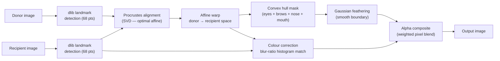

# Face Image Swap

[](https://www.python.org/)
[](https://opencv.org/)
[](http://dlib.net/)
[](LICENSE)

Facial landmark-guided **face compositing** pipeline: extracts the face region from a donor image and seamlessly blends it onto a recipient image using affine transformation, colour correction, and Gaussian feathering. Also includes a GAN-based splice variant (`pGan_fSplice.py`) and a MediFor forensics dataset downloader.

---

## Algorithm



### Key steps

| Step | Method | File |
|------|--------|------|
| Face detection | HOG + SVM frontal detector (`dlib`) | `face_swap.py` |
| Landmark detection | 68-point shape predictor (`dlib`) | `face_swap.py` |
| Alignment | Procrustes (SVD minimisation of affine transform) | `face_swap.py` |
| Warping | `cv2.warpAffine` with `BORDER_TRANSPARENT` | `face_swap.py` |
| Colour correction | Gaussian blur ratio (`COLOUR_CORRECT_BLUR_FRAC = 0.6`) | `face_swap.py` |
| Compositing | Weighted per-pixel blend via feathered mask | `face_swap.py` |
| GAN splice variant | Progressive GAN donor + Poisson blending | `pGan_fSplice.py` |

---

## Quick Start

### Install dependencies

```bash
pip install -r requirements.txt
```

You also need the dlib facial landmark model (68-point):

```bash
# Download pre-trained model (~95 MB)
wget http://dlib.net/files/shape_predictor_68_face_landmarks.dat.bz2
bzip2 -d shape_predictor_68_face_landmarks.dat.bz2
mv shape_predictor_68_face_landmarks.dat pretrained_model.dat
```

### Run face swap

```bash
python face_swap.py -d <donor.jpg> -r <recipient.jpg> -o <output.jpg>
```

```python
# Or use as a library
from face_swap import swap_donor_recipient

swap_donor_recipient(
    image1="recipient.jpg",   # face to keep background from
    image2="donor.jpg",       # face to extract and blend in
    imageout="result.jpg"
)
```

---

## Results

| Donor | Recipient | Output |
|-------|-----------|--------|
|  |  |  |

The algorithm handles different face sizes, orientations, and lighting conditions via Procrustes alignment and histogram-matched colour correction.

---

## Files

| File | Purpose |
|------|---------|
| `face_swap.py` | Core face swap: landmark detection → affine warp → colour correction → composite |
| `pGan_fSplice.py` | GAN-enhanced variant: uses Progressive GAN-generated faces as donors; includes Poisson blending |
| `medifor_browser.py` | MediFor API browser for downloading image forensics datasets (media, journals, cameras) |

---

## Requirements

- **dlib ≥ 19.24** — facial landmark detection. Install: `pip install dlib` (requires CMake + C++ compiler)
- **OpenCV ≥ 4.8** — image I/O, warping, Gaussian blur
- **NumPy ≥ 1.24** — matrix algebra for Procrustes alignment
- **Requests ≥ 2.31** — HTTP for `medifor_browser.py`

---

## License

MIT — see [LICENSE](LICENSE).
